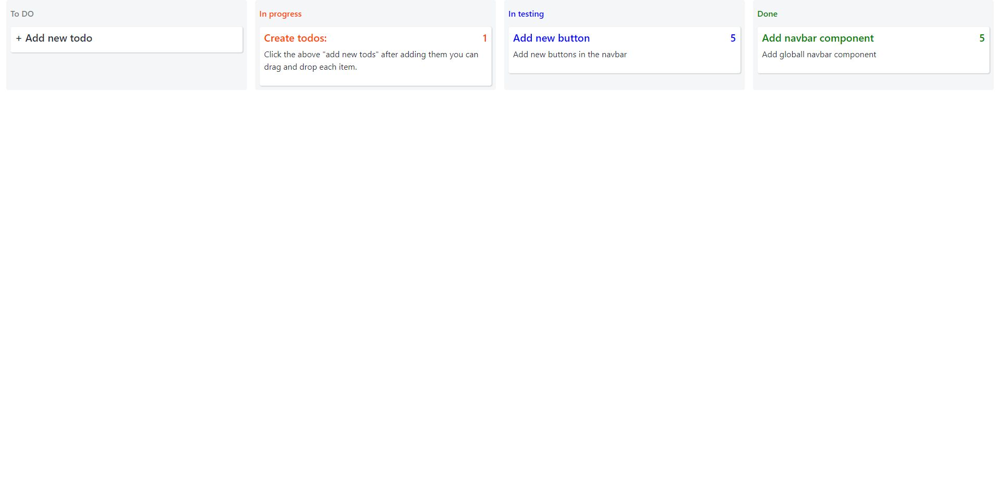

# Task Management App

A simple task management application with drag-and-drop functionality to organize tasks into different stages: To Do, In Progress, In Testing, and Done.

## Project Overview

This project provides an interactive interface for managing tasks. Users can add new tasks and move them between different stages using drag-and-drop. The application is built with HTML, CSS, and JavaScript, with Bootstrap used for styling.

## Features

- **Task Creation:** Add new tasks using a form.
- **Drag-and-Drop:** Move tasks between stages using drag-and-drop.
- **Dynamic Form:** Toggle the visibility of the task form.
- **Visual Feedback:** Drop targets show a shadow effect when a task is dragged over them.

## Screenshot



## Technologies Used

- **HTML:** Provides the structure of the application.
- **CSS:** Custom styles and Bootstrap for layout and design.
- **JavaScript:** Manages interactivity, drag-and-drop functionality, and form handling.

## Files

- **index.html:** The main HTML file providing the layout for the task management app.
- **index.css:** Contains custom styles for the app.
- **events.js:** Functions for handling drag-and-drop events and form interactions.
- **services.js:** Functions to render task elements and the form.
- **helpers.js:** Helper functions for drag-and-drop visual effects and generating form elements.
- **types.js:** Defines types used in the application.

## Getting Started

1. **Clone the Repository:**

   ```bash
   git clone https://github.com/jakimoski/todo-drag-and-drop.git
   cd <repository-directory>
   ```
